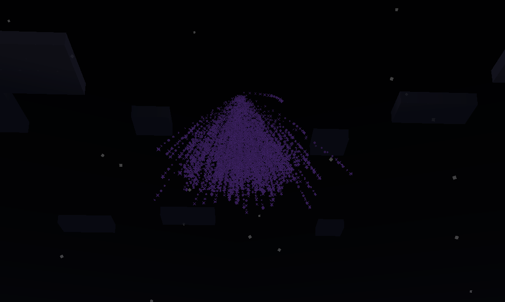
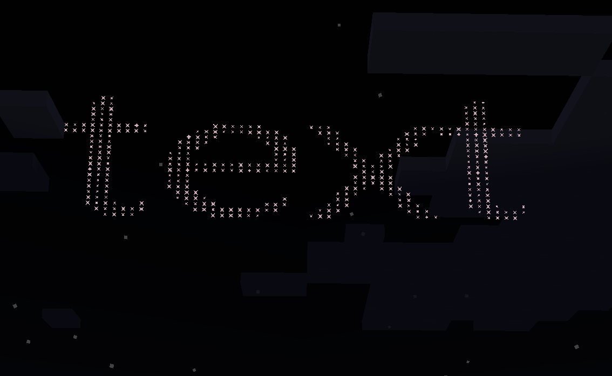
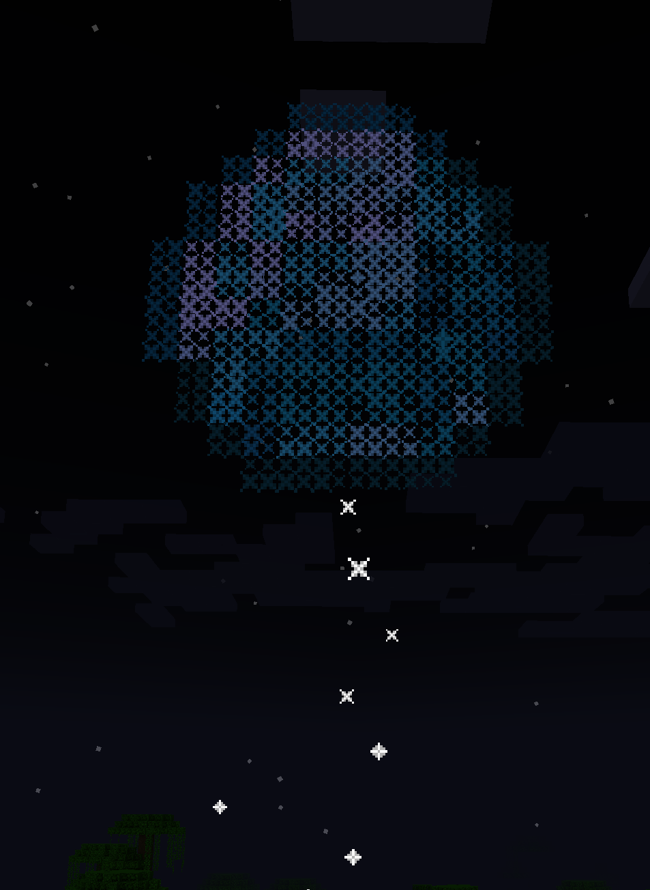

#### For earlier version of this mod, please check the [old version](https://github.com/xiaoyu233/SuperFirework/tree/1.20.1/README_OLD.md)

---
## What does this mod do
Vanilla Minecraft's fireworks are not big enough and them have not many styles.\
So this mod adds some amazing firework explosion styles into minecraft\
You can find all the fireworks in the "Super Firework" creative table
## For larger particle limits
By default, Super Firework will modify the vanilla particle manager to support up to `32768` particles rendering at the same time\
But it will be laggy for most users when the particle count reaches the limit

Super Firework is compatible with MadParticle, which can greatly optimize the rendering of particle\
and make it possible for rendering thousands of particles at the same time\
To enlarge the particle limit without getting laggy, you need to install MadParticle([Curseforge](https://www.curseforge.com/minecraft/mc-mods/mad-particle), [Modrinth](https://modrinth.com/mod/mad-particle)) \
and set the value of max particle count in the MadParticle config\
(Super Firework will auto register the firework particle to MadParticle Renderer and Async Ticker, so you don't need to change the takeover method)

## Fireworks Examples
#### Explosion Types
Large ball:

Triple sphere:

Waterfall(NEW, Trail:1b, Speed:1.5f):

Text:

Image(Name: "textures/item/diamond.png"):

#### Clone Firework(Launch four same fireworks at four corners when explode)


---
## Super Firework Data Specifics
### `Fireworks` Compound in Super Firework Item
The data structure in the `Fireworks` NBT compound of super firework and clone firework is like vanilla:
```
Explosions: NbtList
    - A firework explosion
        Type: String (The id of firework explosion type, like "ball")
        Size: int (Generally controls how many particles will this explosion create, the larger the more particles)
        Speed: double (Generally controls the speed of the particles, the larger the further the particles travel)
        <Other Explosion Type Specificed Extra Data>
        
        Colors: IntList (Controls the initial color of the particles, if unset, will randomly generate when explode)
        FadeColors: IntList (Controls the end color of the particles, you can set it to an empty IntList to randomly generate a color when explode)
        Trail: boolean (Whether the particles will leave a trail)
        Flicker: boolean (Whether the particles will twinkle)
        Explode: boolean (Whether the particles will explode and create particles with the count of "Size" when they reach the end of their life [Not recursively])
        Gravity: NbtCompound (Controls the normal distribution of particle gravity strength, defaultly: m=0.1,d=0)
        {
            m: double (The mean value of the particle gravity distribution, the larger the stronger the gravity)
            d: double (The devitaion value of the particle gravity distribution, the larger the more different between particles' gravity)
        }
        MaxAge: NbtCompound (Controls the normal distribution of particle max age, defaultly: m=54,d=6), the data structure is same as Gravity
```
### Super Firework Entity Data Specifics
```
<The vanilla firework_rocket data, like FireworkItems, Life, LifeTime>
Clone: boolean (Controls whether the firework entity will clone four same fireworks when explode)
```
### Explosion Types
***Note that since the version 1.0.0, we use the explosion type id instead of numeric id***

#### Ball(id: "ball")
No extra data
#### Large Ball(id: "large_ball")
No extra data
#### Random Ball(Irregular ball, id: "random_ball")
```
RandomFactor: double (Controls how much randomness between the particles' speed, the larger the more messy the ball will be)
```
#### Triple Ball (id: "triple_ball")
No extra data
#### Burst (Same as the Burst firework in vanilla, id:"burst")
No extra data

***New***
####  Waterfall (Like Burst,but generates particles downward, id: "waterfall") 
No extra data\
For this explosion type, `Speed` is used to control the horizontal speed of the particles\
To control the downward speed of the particles, you can use `Gravity` data
#### Creeper (Same as the Creeper firework in vanilla, id: "creeper")
No extra data
#### Star (Same as the Star firework in vanilla,id: "star")
No extra data

***New***
#### Image (Make the fireworks particles look as the same as the image, id:"image")
```
Zoom: double (Controls the size of the image, the larger the more detailed the presented image will be, and the more particles will be generated)
Rotation: double (Controls the rotation of the image in y-axis, in angle degrees)
Name: String (The path to the image file, like: "textures/item/diamond.png" will use the diamond item's texture, you will need to contain the .png file suffix)
```

***New***
#### Text (Show a text with fireworks particles, id: "text")
```
Font: String (The font name or TTF font file path under the "assets/superfirework/fonts/*.ttf", like: "Default"(name), "Simsun"(name), "beautiful_font"(path), will use "Default" font if unset)
Rotation: double (Controls the rotation of the text in y-axis, in angle degrees)
Content: String (The text content to show)
Size: int (Overrides the default one. Controls the size of the text, the larger the more detailed the presented text will be, and the more particles will be generated)
```

***New***
#### Custom (Custom shape, id: "custom")
```
Shape: 2d panel X-Y coordinate array(double[n][2]) (Controls the vertex of the shape, particles will draw lines between the vertexes)
```
---
### Command Examples
```
/summon superfirework:super_firework ~ ~ ~ {Clone:1b, LifeTime:60,FireworksItem:{id:"firework_rocket", Count:1, tag:{Fireworks:{Explosions:[{Type:"waterfall", Size:100, Explode:0b,Speed:1d}]}}}}
```
Will summon a firework with a life time of 60 ticks, and the firework will explode into a **waterfall** explosion when it reaches the end of its life\
Meanwhile, the firework will clone four same fireworks when it explodes and shoot them to the four angles\
And this **waterfall** explosion will create 100 particles, and the particles will not explode when they reach the end of their life, and the speed of the particles is 1.0d
```
/summon superfirework:super_firework ~ ~ ~ {LifeTime:40,FireworksItem:{id:"firework_rocket", Count:1, tag:{Fireworks:{Explosions:[{Type:"text", Content:"Test", Font:"Microsoft YaHei", Size:10, Gravity:{d:0.3d, m:0.0d},Speed:1d}]}}}}
```
Will summon a firework with a life time of 40 ticks, and the firework will explode into a **text** explosion when it reaches the end of its life,\
which show the text "Test" with the Microsoft YaHei font in font size 10,
And the speed of the particles is 1.0d, the distribution of the particles' gravity will follow a normal distribution with mean 0.0 and standard deviation 0.3
```
/summon superfirework:super_firework ~ ~ ~ {LifeTime:40,FireworksItem:{id:"firework_rocket", Count:1, tag:{Fireworks:{Explosions:[{Type:"ball", Size:10, Gravity:{d:1d, m:0.1d}, MaxAge:{d:20d, m:80d}, Explode:1b, Trail:1b, FadeColors:[I;] ,Speed:1d}]}}}}
```
Will summon a firework with a life time of 40 ticks, and the firework will explode into a **ball** explosion when it reaches the end of its life,\
And the speed of the particles is 1.0d, the distribution of the particles' gravity will follow a normal distribution with mean 1.0d and standard deviation 0.1d\
The distribution of the particles' max age will follow a normal distribution with mean 80 and standard deviation 20\
The fade color of these particles will be randomly generated, and the particles will explode into more particles when they reach the end of their life, and the particles will leave a trail when they move

### Other notes
1. The super firework item and the clone firework item with empty NBT tag will create random firework explosion when they are used\
    (But they will not create explosion of type "custom", "text" and "image" as they require extra data)
2. When you used a firework with the "text" and "image" explosion type, the game will cache the fonts or the images used in the firework\
    So it may be laggy for the first explosion, but it will be faster for the later explosions using the same font or image\
    If you want to clear the cache from memory, just reload the Minecraft resources, the caches will be cleared
